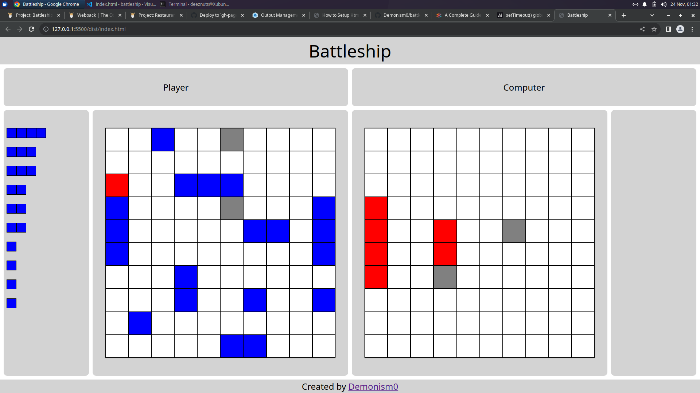

# battleship

Battleship web game project completed as part of The Odin Project's Javascript Course.
Click to select a ship from the box on the left, and place it on the grid.
Ships cannot overlap with each other, and you have to place one of every ship.
Click 'R' on the keyboard to rotate the ship.
Once all the ships have been placed, the game can begin. Click on one of the tiles on the computer's gameboard attack it, and start the game.
The computer will attack a random tile on your gameboard.
The game ends once all the ships of a player have been sunk.
Press play again on the dialog that appears, to start a new game.
